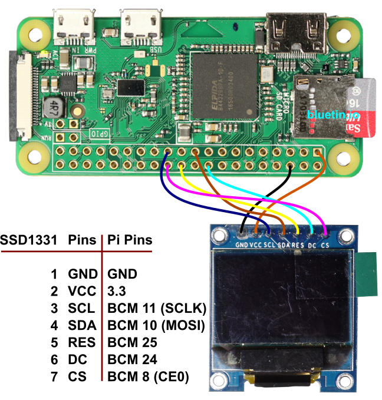

# Eye of the Pi

This project started because I wanted to make [this thing](https://learn.adafruit.com/animated-snake-eyes-bonnet-for-raspberry-pi) I saw on Adafruit.

The project described there works the following way - a Python application draws these eyes using OpenGL (pi3d) on your normal screen and then there is a C program (`fbx2`)
that continuously copies image from the screen framebuffer to the displays connected over SPI.

I did not have Adafruit's board, my cheap displays from Aliexpress were slightly different and I could not make the whole thing work despite the effort.
So I decided to do it in an alternative way and use the opportunity to do it in Python only, no `fbx2`.

It was most interesting to me to play with the low-level display stuff (reading datasheet and playing with commands) so I guess I missed lots of ready-to-use libraries
like [Luma.OLED](https://luma-oled.readthedocs.io/en/latest/hardware.html)

The Python code in [Original Adafruit Pi_Eyes sources](https://github.com/adafruit/Pi_Eyes/) I found difficult to follow and modify because
it was a bit monolithic - everything was done in one huge `frame` method and there were lots of globals. And two-eyed version (`eyes.py`) was like 95% identical code.

So I refactored it to be a bit more OOP-ish and introduced a clear separation between rendering code (the `Eye` class that draws the eye in a certain state using pi3d)
and animation code (that controls eye state based on time or GPIO input).

Because the new version does not require `fbx2`, it does not have to be run under root.

## How to use
It is still work in progress really...

## Inner bits

### OLED adapter
* `SSD1351.py` - the "driver" for the SSD1351 display that initialises it
and allows flushing the internal framebuffer to the OLED. It also has couple of methods - one to fill the entire framebuffer with a single colour
and another - to copy an image into the framebuffer.
* `test.py` is just a very simple test to check the display and its driver work - it contiuously fills the display with red, then gren, then blue in a loop and prints
how many times per second it can flush the framebuffer (the fps).
* `blank.py` - a small script to just fill OLED with black - it is handy when you terminated an app you are working on and want last image to disappear from OLED screen.

### Eye graphics
`eye.py`, the `Eye` class with eye-drawing logic (eye 3D model) extracted from the original `cyclop.py` and `eyes.py`

It relies on files from the [Original Adafruit Pi_Eyes sources](https://github.com/adafruit/Pi_Eyes/):
  * `gfxutil.py` - no changes, original code
  * `graphics/` directory - the original graphics, no changes

### Eye model
`model.py`, the `EyesModel`, `TwoEyesModel` and friends - model state of one or more eyes.
They implements autonomous random blinking and expose methods to modify state of a single eye or all of them.
Sush as `open_eye`, `close_eye`, `start_blink`, `complete_blink`, `set_position`, `set_pupil_size`.

The model is the key in separating eye graphics rendering and behaviour. Once the rendering is initialised and started,
the application can just make decisions on eye behaviour (where eyes should be looking, what pupil size should be etc) and then implementing
these decisions by manipulating the model properties.

### Rendering
`renderer.py` provides `Renderer` class that just continuously reads state of the eyes (from an `EyesModel` passed to it) and renders frames based on that changing state.

`copier.py` provides `FrameCopier` class whose job is to continuously copy a fragment of the frame (obtained from `Renderer`) into OLED screen.
You will need one copier per eye each dealing with its own OLED.

### Sample

`sentinel.py` - a simple application that demonstrates how to use all the machinery. It initialises two-eyes model, renderer and two OLED screens,
and then sleeps polling a proximity sensor. When sensor reports an object in range, the eyes open and begin autonomous movements
that continue as long as sensor keep confirming the object is still in range. When object leaves, eyes close and the whole thing goes to sleep.
Then the cycle repeats.

### Other

Other files from the [Original Adafruit Pi_Eyes sources](https://github.com/adafruit/Pi_Eyes/):
  * `cyclop.py` - that has been refactored. The animation logic still remains the this file (although moved to `Animator` class) while eye-rendering logic was moved to
a new `eye.py` file (`Eye` class). The refactoring is still work in progress. When run, it displays the animated eye on the screen and duplicates image to the OLED screen via `SSD1351` library above.
  * `eyes.py` - I only started working on it and converted to use `Eye` class. As it is still work in progress, when run, it just displays the animated eyes on the screen but does not try to duplicate image to OLED screens. Need to connect two first...

If you want to run it - just run `cyclop.py` - it should render an eye into a small 128x128 window and at the same time copy the content to the OLED screen connected.

## How to connect
At the moment, I am playing with just a single display which is connected the following way

| Display        | Pi 3 pin       |
| -------------- |:--------------:|
| GND            | any GND        |
| VCC            | any +3V        |
| SCL            | 23 SCLK (SPI)  |
| SDA            | 19 MOSI (SPI)  |
| RES            | 22 GPIO 25     |
| DC             | 18 GPIO 24     |
| CS             | 24 CE0 (SPI)   |

The image below is from [OLED Display Library Setup for the Raspberry Pi featuring SSD1331](https://www.bluetin.io/displays/oled-display-raspberry-pi-ssd1331/).
It shows Pi Zero but I used exactly the same pins for my regular Pi 3.


## Performance

First of all, `python3` is recommended to run the application over the 2.x version.
It seems that with Python 2 `py-spidev` gets into a GIL (global interpreter lock) or something so it cannot flush frames to two OLED screens concurrently..
Because of that there is no benefit from running independend threads for each screen, operations gets performed sequentially and the frame rate suffers.

Also, the standard `py-spidev` library used to communicate with SPI devices only support 4K buffer. Which is not optimal as each 128x128 frame for OLED takes about 48K,
it has to be sliced into small chunks. For optimal performance you need to:
1. install `py-spidev` version that supports `xfer3` method - see https://github.com/doceme/py-spidev/pull/75
2. then make sure your kernel is configured with large blocks

You can check the current block size with:
```
cat /sys/module/spidev/parameters/bufsiz
```
If it is set to 4K, increase it by editing `/boot/cmdline.txt` and adding `spidev.bufsiz=65535` there and rebooting.
(This is for Raspberry. Not sure how it is done on other Linux'es)


## Notes

The choice of the format for the framebuffer was driven by two things:
* when you are using `pi3d` to take the screenshot of what you rendered with OpenGL, you are getting back a 3-dimensional `numpy.ndarray` - height x width x 3 (for RGB).
* `spidev.xfer` method can only understand normal python lists (`[0, 1, 2...]`) and does not understand neither `array.array` nor `numpy.ndarray`

Obviously conversion was unavoidable and as I discovered that in Python operations like `dst[b:b+n] = src[a:a+n]` are INSANELY slow, I choosen to keep
data in really efficient `numpy.ndarray` instead (where the same operation is fast) and only convert it to the list the moment we are sending data to the screen.


## Links
* [The project on Adafruit](https://learn.adafruit.com/animated-snake-eyes-bonnet-for-raspberry-pi?view=all)
* [Original Adafruit Pi_Eyes sources](https://github.com/adafruit/Pi_Eyes/)
* [Adafruit SSD1351 Python library](https://github.com/twchad/Adafruit_Python_SSD1351)
* [Adafruit's board](https://www.adafruit.com/product/3356). I did not have it but it shows nice video how these eyes should operate
* [SSD1351 datasheet](https://cdn-shop.adafruit.com/datasheets/SSD1351-Revision+1.3.pdf)
* [Luma.OLED](https://luma-oled.readthedocs.io/en/latest/hardware.html) - I haven't used it though
* [OLED Display Library Setup for the Raspberry Pi featuring SSD1331](https://www.bluetin.io/displays/oled-display-raspberry-pi-ssd1331/)


